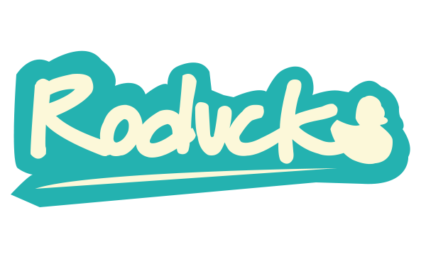
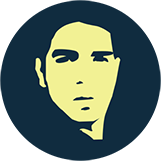
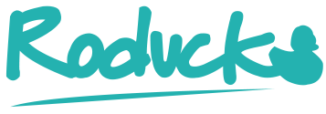

[](https://opensource.org/licenses/)

---
# A PHP modern, scalable and light MVC Framework.

## Setup Local Environment
### Required Software:

* Docker [v3.6.0](https://docs.docker.com/get-docker/) or higher
* Lando [v3.1.4](https://lando.dev/download/) or higher

### Getting Started:

1. Start container:
```
$ lando start
```

2. Connect to VM:
```
$ lando ssh
```

3. Install composer dependencies:

```
# composer install
```

4. Install `Documentation` module:
```
# php roducks documentation
```

5. Create an Admin user:
```
# php roducks user:create --admin
```
### Done!

Now go to: http://roducks.lndo.site/

---
## Roducks CLI
Run `help` to list available commands:
```
# php roducks help
```

Check `version`:
```
# php roducks -v
```

Check `status`:
```
# php roducks status
```


# About Me



My name is `Rod Cervantes` and I'm a software Engineer with 12+ years of experience in PHP who is passionate about Web Technology and is always finding new ways of innovation.

## Why  ?
I'm a very creative Developer so I wanted to create a tool for others Developers to make powerful Web Applications in few steps and not to get crazy with installation instructions. The main purpose is to develop faster applications with an easy framework to work with and having the best good practices supported by a detailed documentation.

## Contributions

I hope there will be many collaborators in the near future who love supporting the framework and take it to a higher level. <3